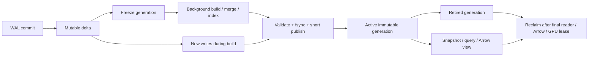

# Akasha：生命週期、資料複製與官方 API 盤點

查核日期：2026-09-07。固定程式基線：`94ff55f`（#33 已提交）。
工具鏈：實際執行 `pixi run mojo --version` 得到 Mojo 1.0.0 (`ed45d567`)；
Pixi 鎖定 MAX 26.5.0。使用者指定的 [Mojo 文件](https://mojolang.org/docs/)
及 [llms.txt](https://mojolang.org/llms.txt) 也標示 1.0.0。

## 結論與盤點範圍

目標包含 Qdrant 類型的資料／索引生命週期、可量測的最少資料複製，以及優先
使用官方 API。不能靠把所有 `List` 改成裸指標完成；需要讓 immutable generation、
snapshot、Arrow export 與 GPU buffer 共享可追蹤的 owner。

這輪建立 `src/`、`python/`、`apps/`、`native/` 的函式宣告清單：
**1,567 個宣告，分布於 77 個含函式的檔案**，其中 Mojo 1,354、Python 205、C 8。
含方法、trait／protocol 宣告與具名內部函式；不含測試、benchmark、reference 或
第三方依賴。Mojo／C 採宣告掃描、Python 採 AST；這是普查基數，不是正式 compiler
symbol table，也不代表 1,567 個函式均經逐行正確性審查。

完整清單：[function-inventory.csv](2026-09-07-function-inventory.csv)。
人工查核集中於可重用的通用演算法、跨語言邊界及完整的寫入／讀取／回收路徑。
清單有 342 個宣告連到本文 A、Z、L 查核範圍，標記為 `discussed_in_audit`；
另外 1,225 個標記為 `inventory_only`。前者表示有相關查核結論，不代表每個方法均經
逐行驗證；後者不能當成「已證明沒有問題」。

盤點期間另有開發流程修改 collection、snapshot、GPU planner／executor，並新增
`compute/gpu/context.mojo`。下列「目前」均指固定基線；GPU 資源問題需要在 #34
交付後重新核對，不能把正在修改的檔案當成已驗證完成。

## A：官方 API 與重複實作

| ID | 現有函式／模組 | 官方能力與查核判斷 | 處理與驗收 |
|---|---|---|---|
| A01 | `index/bitmap.mojo::_popcount` | `std.bit.pop_count` 有相同 UInt64 位元計數能力；編譯與 1,028 個值的差異測試通過 | 可直接使用官方 primitive；保留現有 bitmap 語意 |
| A02 | `Bitmap.set_ordinals` 逐 word 掃 64 個 bit | `std.bit.count_trailing_zeros` 可逐個列舉 set bit | `word != 0` 時取最低 set bit，再 `word &= word - 1`；需覆蓋 0、63、64、尾端 padding 與順序 |
| A03 | `keyword::_sort_keyword_entries/_sift_keyword`；`sorted_block::_sort_int_entries/_sift_int/_sort_float_entries/_sift_float` | 官方 `sort(Span(...))` 可取代手寫 heapsort。但這些 entry 目前只有 `Movable`，官方要求 `Copyable`，需比較順序適配 | 先補合適的 Copyable／Comparable，保持 name/type/value/ordinal 全序並量測 string 複製；不能直接刪 helper 後假設會編譯 |
| A04 | `CandidateMinHeap`、`ResultMaxHeap`、`BoundedTopK` 的 `_sift_up/_sift_down` | 官方 `BinaryHeap` 有 capacity、push、pop、peek、clear；自訂 score/ID 全序探針通過 | 保留 Akasha 的 bounded admission、min/max 方向、ID／slot ties 與空 heap Error；評估 pop+push 替代 root replacement 的成本後採用 |
| A05 | `storage/memtable::_clone_vector`、`api/collection::_clone_vector`、`DocumentRecord.clone` 中 F32 複製迴圈 | `List.copy()` 已有等價 owned 複製；MemTable 與其他路徑也已在使用 | 可改用官方 copy，並保留 get／export 的 owned-result 合約；這會移除重複迴圈，但不會變成 zero-copy |
| A06 | `BinaryWriter.write_bytes` 逐 byte append；`RetiredFileBatch.clone` 等同型別複製 | `List.extend(Span(...))`、`List.copy()` 可重用，List move 可交接 ownership | primitive List 可以直接改；含 Movable-only 元素的集合先檢查 trait；回收佇列搬移 retained batch 可避免複製檔名 |
| A07 | `SparseIndex._find_record/_find_term`、`search_dot` 的 score lookup；`fusion::_accumulate` 線性尋找 ID | 官方 `Dict` 已可用，MemTable／Metadata 已採用 | 以 Dict 維護 ID/term→ordinal 與 score 累計；swap-remove 時更新 lookup，保持浮點累計順序、tie 與刪除語意 |
| A08 | `BoundCollection.apply_arrow_batch` 逐元素 `Float32(py=...)`；`_float_vector/_float_vectors` | 官方 `std.python.numpy.from_numpy_array` 可將一維 contiguous NumPy buffer 借用成 origin-tracked Span；NumPy 已是依賴 | Arrow primitive buffer 可經零拷貝 NumPy view 進 Mojo；保留 producer owner，檢查 dtype／offset／stride／readonly／null；持久化接受資料的 ownership 交接仍需設計 |
| A09 | `filesystem.read_file_bytes`、`operations::_copy_immutable` | 已使用官方 FileHandle；官方 `read(Span)` 與 `write_all(Span)` 可支援 bounded buffer I/O | backup 改成有界 chunk 複製可減少峰值記憶體；處理 short read、fsync、manifest-last 與中斷清理；不宣稱這是零拷貝 |
| A10 | `filesystem::_parent_directory` 手動拆 UTF-8 bytes | 官方 `std.os.path.dirname` 可作路徑解析基礎 | 必須比較空字串、相對路徑、root、尾斜線、重複斜線的既有合約；directory fsync ordering 仍由 Akasha 負責 |
| A11 | `Bitmap` 整體 | 官方 `BitSet[size: Int]` 是編譯期大小、inline words；Akasha bitmap 大小為執行期，還有 cached cardinality 與 slot alignment | 保留 domain bitmap；使用官方 bit primitives，不能直接拿固定 BitSet 取代 |
| A12 | `checksum::crc32/crc32_range/_crc32_update`、BinaryReader/Writer、各版本 codec | 查過 1.0.0 官方 stdlib index，未找到符合既有 CRC-32/ISO-HDLC 與 durable format 的完整替代 API | 保留 format wrapper／檢查；可另評估成熟 CRC library，但不可把 CRC32C 當 CRC32。lockfile 兩種 library 都存在；採用 transitive library 前仍須明確依賴與跨平台驗證 |
| A13 | `MappedFile.open_readonly`、fsync／flock／rename wrappers | 使用官方 `external_call` 呼叫 POSIX。官方 `stat` 雖描述 file descriptor，實際 1.0 原始碼只接受 PathLike 並呼叫 `__fspath__` | 不能用 path stat 取代對同一個已開啟 fd 的 fstat，避免 TOCTOU；保留 mmap／ABI guard。`_libc_errno`、`_triple_attr` 是隔離在邊界的內部依賴，目前未找到等價公開替代 |
| A14 | `NativeWorker`／pthread worker | batch 已用官方 `max.algorithm.parallelize`；MAX 26.5 的 scoped parallel work 不能直接等同長期 background queue、drain、failure propagation | 保留小型 pthread FFI 邊界；若未來有公開的同語意 worker API，再以生命週期測試替代。不可換成遇錯會 trap 的 parallel overload |
| A15 | `compute/gpu/flat_scan` 自製 score／Top-K kernels | DeviceContext、DeviceBuffer、TileTensor 已採官方。MAX 26.5 原始碼另有 `nn/topk.mojo::top_k` | 先做安裝套件可 import、Metal target、k／ragged cases、signed point-ID ties 與 allocation 的 capability gate；上游 source 有函式不等於已證明可直接替代。只在官方能力不符部分保留專用 kernel |
| A16 | BF16／F16 codecs、SIMD、並行 query、MemTable／Metadata lookup | 已使用 `BFloat16/Float16`、`bitcast`、SIMD load/reduce、`max.algorithm.parallelize`、`Dict`、sort | 已重用官方能力。輸入驗證、scalar oracle、metric dispatch 與 deterministic ties 是 Akasha 合約，不能當重複實作刪除 |
| A17 | `_copy_*stats` 重複欄位拷貝、FilterExpression owned clones | 可評估讓純 value stats 符合 Copyable，使用官方 copy；origin／Move-only owner 不適合一律如此處理 | 僅在型別語意相同時簡化；優先度低於資料向量／payload 複製 |
| A18 | HNSW levels／config fingerprint、ANN traversal、WAL publish／recovery 狀態機 | 沒有找到 stdlib 的等價 DB 功能；固定 SplitMix64、fingerprint、versioned bytes 均有可重現／相容性語意 | 保留領域邏輯。不能改用一般 `hash()`／隨機產生器而改變 collection identity 或 deterministic graphs |
| A19 | Python protocol serialization、replica transport、server routes | 已使用 Python `json`、`zlib.crc32`、`multiprocessing.connection`、FastAPI／Pydantic；Mojo 沒有同功能不代表 Python 層也應重寫 | 保持成熟實作與 protocol wrapper 分工；coordinator quorum 不是正式 Raft，升級共識時先評估 raft-rs／etcd-raft 的整合邊界 |

已使用的官方能力不只來自顯式 import：List、Span、sort 等也由 prelude 提供。
普查記錄的 73 個 std/MAX import statements 不是 API 使用次數。

官方依據：
[pop_count](https://mojolang.org/docs/std/bit/bit/pop_count/)、
[count_trailing_zeros](https://mojolang.org/docs/std/bit/bit/count_trailing_zeros/)、
[sort](https://mojolang.org/docs/std/builtin/sort/sort/)、
[BinaryHeap](https://mojolang.org/docs/std/collections/binary_heap/BinaryHeap/)、
[List](https://mojolang.org/docs/std/collections/list/List/)、
[BitSet](https://mojolang.org/docs/std/collections/bitset/BitSet/)、
[NumPy borrow](https://mojolang.org/docs/std/python/numpy/from_numpy_array/)、
[FileHandle](https://mojolang.org/docs/std/io/file/FileHandle/)、
[Mojo 1.0 stat source](https://github.com/modular/modular/blob/mojo/v1.0.0/mojo/stdlib/std/os/fstat.mojo)、
[MAX 26.5 parallelize](https://github.com/modular/modular/blob/max/v26.5.0/max/mojo/max/algorithm/backend/cpu/parallelize.mojo)、
[MAX 26.5 Top-K](https://github.com/modular/modular/blob/max/v26.5.0/max/kernels/src/nn/topk.mojo)。

## Z：資料複製路徑

| ID | 固定基線的入口 | 複製／配置來源 | 建議與可量測驗收 |
|---|---|---|---|
| Z01 | `ReadSnapshot.capture` (`api/snapshot.mojo:88`) | clone 完整 MemTable、重建 metadata、clone SparseIndex；後者還透過 records→upsert 重建 postings | immutable generation 共享 owner，mutable delta 以有界凍結／版本化方式隔離；snapshot 建立成本不再隨全部 vector/payload bytes 增長 |
| Z02 | `PersistentCollection._flush_unlocked` (`api/collection.mojo:1449`) | 先 `live_entries()` 全量 clone，再於 incremental case 改成 `entries_after()` | 先分支再 materialize 正確集合，避免被丟棄的全量 clone；檢查只更新少量 IDs 時 copied bytes 跟 delta 成比例 |
| Z03 | Arrow import (`bindings/python_module.mojo:321`) | Python buffer 每元素索引與 boxing，再寫入 owned lists；payload `.as_py()` 逐欄逐列轉換 | primitive column 用官方 borrowed Span；字串／bool／null 需遵守 Arrow buffers 合約。API 接受／WAL 編碼的拷貝單獨計數 |
| Z04 | Arrow export (`python/akashadb/arrow.py:76`) | search results 先成 Python objects，再建立新的 Arrow arrays | 結果直接寫入 engine-owned contiguous result columns，以 Arrow release lease 匯出；新算出的 ID/score 分配是必要輸出，避免的是重複 materialization |
| Z05 | `MemTable.get`、`DocumentRecord.clone`／snapshot export | public API 明確回傳獨立 owned vector／payload | 保留既有 owned API；若增加 borrowed projection／scanner，要讓 lease 持有 generation，不能讓關閉 collection 產生 dangling view |
| Z06 | `wal.preflight_wal`／`decode_wal_bytes`、`BinaryReader.read_bytes` | 整份 WAL decode copy、逐 record／payload slice copy | 借用 Span 的 bounded decoder、單次 checksum、只在進入權威資料 ownership 時複製；保留 torn-tail repair 與所有 bounds／checksum 檢查 |
| Z07 | `_copy_immutable` (`storage/operations.mojo:179`) | 整份 segment 讀入 List 後寫出 | 先改 bounded buffer。若再採檔案 clone／hardlink，要單獨定義 backup 獨立性與同檔案系統限制，不能默默共享可變 inode |
| Z08 | `_execute_gpu_batch`／`execute_device_candidate_batch` | 每次 context／buffers／vector flatten；filtered batch 每 query 重建候選 MemTable | #34 正在處理：官方 buffer owner 與 immutable generation 綁定，ragged candidates 走 offsets／ordinals；量測 context 次數、allocation、staging／transfer bytes |
| Z09 | `ReadSnapshot._search_sq8/_search_pq` | 每次查詢整理 vectors，呼叫 `Sq8Index.build`／`PqIndex.build`，包含 PQ training | 將衍生索引提升為 generation/config-bound 可重用 artifact；發布／失效跟 generation 一致，查詢不重複訓練 |
| Z10 | HNSW mapped base | 已有 file-backed mapping，未複製 vector／adjacency 成 owned graph；但權威 F32/payload 仍進 MemTable | 保留已有 mapped graph；將 zero-copy 優化延伸至 authoritative immutable data，不能把 HNSW mmap 當成整個 DB 已不佔 heap |

`ArcPointer` 的 reference clone、`Span` 的 view 與深拷貝 payload 必須分開計算。
目前 Python `ArrowBatchLease` 確實持有 PyArrow 匯入物件；Mojo 的
`ArrowConsumerLease` 則是一次釋放的狀態／測試模型，並沒有實作原始 C release callback。
這些既有型別不能當成 engine-owned buffer 匯出與跨 collection-close lease 已完成的證據。
Apple unified memory 上使用 `map_to_host` 也不能單靠 API 名字判定沒有傳輸或同步成本。
最低計量包括：snapshot copied bytes、query staging bytes、payload materialization bytes、
WAL encode bytes、H2D/D2H bytes、resident bytes、scratch peak、allocation count。

## L：Qdrant 類型的生命週期管理

Qdrant 本地 reference 的 `lib/shard/src/optimize.rs` 展示：用 proxy／COW 接住建置期間的
寫入，在慢速 build 完成後，於短暫鎖定中補齊變更並 swap。`optimizers/` 再分出 indexing、
merge、vacuum、configuration mismatch 策略。這些是可參考的狀態轉移，不代表必須把
Qdrant 的所有抽象或 Rust locking model 搬進 Mojo。
[上游 optimize 實作](https://github.com/qdrant/qdrant/blob/master/lib/shard/src/optimize.rs)

| ID | Akasha 已有 | 目前缺口／下一步 | 必要驗收 |
|---|---|---|---|
| L01 | collection exclusive writer、close／RAII、worker drain | 整理 accepting→draining→closed 狀態；如果新增 drop，先阻止新請求並協調 leases，再延後回收實體檔案 | 重複 close、close 與 writer／query 並行、worker failure、仍存活的 snapshots／Arrow leases |
| L02 | base/delta segments、atomic manifest generation、generation pins、retired files | 讓 generation 成為 immutable data、metadata、vector indexes 的共同 owner，建立一次發布的可見狀態 | snapshot isolation、replacement/delete 可見性、最後 reader 離開前不可回收 |
| L03 | background maintenance worker、L0 threshold | `_maintenance_entry` 把整次 compaction 放在 writer lock；`backup_to` 也在 lock 內複製檔案 | 背景建置期間寫入可繼續，短 publish seam 補齊 delta／檢查 generation；量測 writer pause 的 p95/p99 |
| L04 | HNSW tombstones、delta threshold、flush／explicit rebuild | rebuild 在 writer lock；SQ8/PQ 仍 query-time build。需要一致的 index build→ready→retire 路徑 | 查詢不偷偷建索引；舊 index 在新 index 成功發布前可用，取消／失敗不破壞原代 |
| L05 | full-coverage compaction 才移除 covered tombstones | 目前主要依 L0 數量與 HNSW thresholds；需依 bytes／deleted ratio／資源預算選 maintenance 工作 | WAL durable ordering 不變，不能回收仍可能遮蔽舊版本的 tombstone；小增量不引發無界重建 |
| L06 | atomic rename、file/directory fsync、crash recovery、保守 orphan quarantine | 背景 jobs 增加後，必須讓 building／published／retired 的 crash 邊界可判定 | 每個發布邊界 kill/restart；未完成 artifact 不可見，已提交 manifest 的 corruption 仍 fail closed |

建議的邏輯生命週期（不是新增 durable format 的既定決議）：



## 已完成的驗證與限制

獨立探針：[official-api-probe.mojo](2026-09-07-official-api-probe.mojo)。

```text
pixi run mojo run docs/research/2026-09-07-official-api-probe.mojo
```

在 Mojo 1.0.0 上編譯並執行成功：UInt64 popcount 差異、bit positions、BinaryHeap、
Comparable score/ID 排序、List owned copy／extend、固定 BitSet、NumPy write-through、
Arrow/NumPy 相同 data pointer、readonly borrow、slice、dtype／stride／rank／mutability 拒絕。
沒有把 API 存在宣稱為整個替換 patch 已完成或已通過 production benchmark。

自訂 `sort[cmp_fn]` 探針遇到 thin/capturing function-type 不匹配；採 `Comparable`
wrapper 的 `sort(Span(...))` 已成功。實作應採已在這個版本編譯成功的方式。
官方 `BitSet` 與 path-based `stat` 的語意差異也已確認，不能當成直接替代。

這輪沒有修改 engine、durable formats 或已在進行的 #34；沒有重跑全套 CPU／crash／GPU。
原始文件快取、固定基線快照與執行日誌保留在 `.build/lifecycle-api-audit/`。
下一輪對具體替換 patch 執行對應測試，整合後再依風險跑跨平台／crash／實機 GPU gates。

## 執行順序

1. 先做 A01/A02/A05/A06 的官方 primitives 替換，以及 Z02 的被丟棄全量複製；逐項驗收。
2. 完成向量 field schema 與權威資料 ownership 設計；把 dense／sparse／named／multivector／binary
   的不同語意明列，不能把 graph scalar kind 當成資料模型。
3. 完成 L02/L03 的 immutable generation、shared snapshots、background build 與短發布邊界。
4. 以 A08/Z03/Z04 打通 Arrow borrowed ingress／direct result export，leases 接入同一 generation。
5. 移除 sparse／fusion 線性 lookup，評估官方 heap／sort／MAX kernels，重用 generation-bound indexes。
6. 在固定 recall、同硬體／資料／filter／並行／服務邊界下與 Qdrant 比較；功能支援與速度分開驗收。

詳細的整合里程碑另見 [single-node lifecycle plan](../plans/2026-09-07-single-node-lifecycle-zero-copy.md)。
